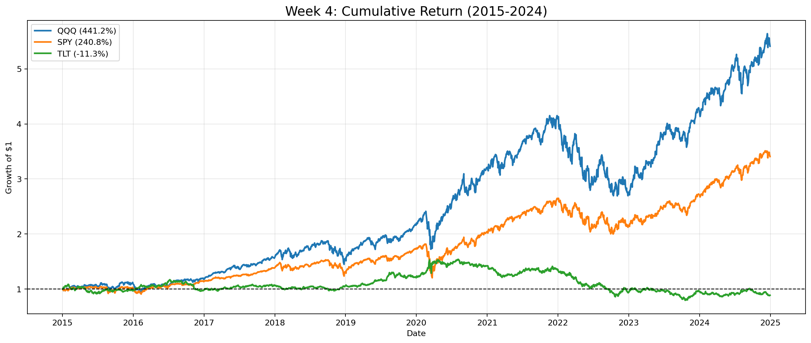
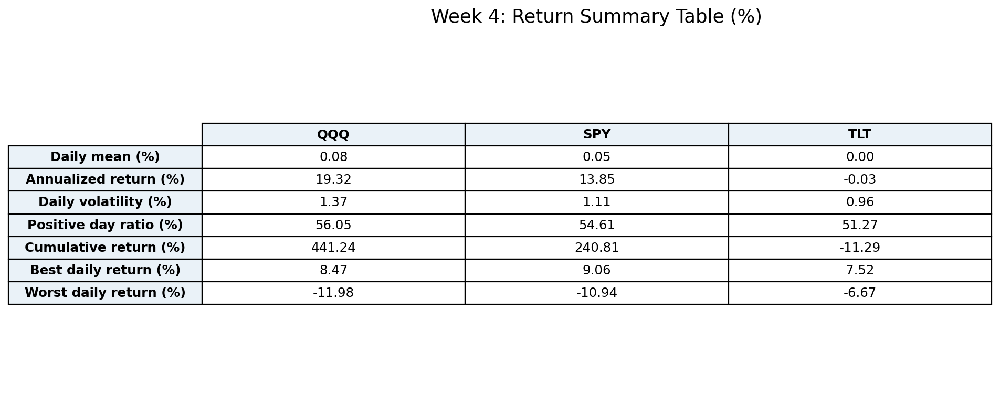
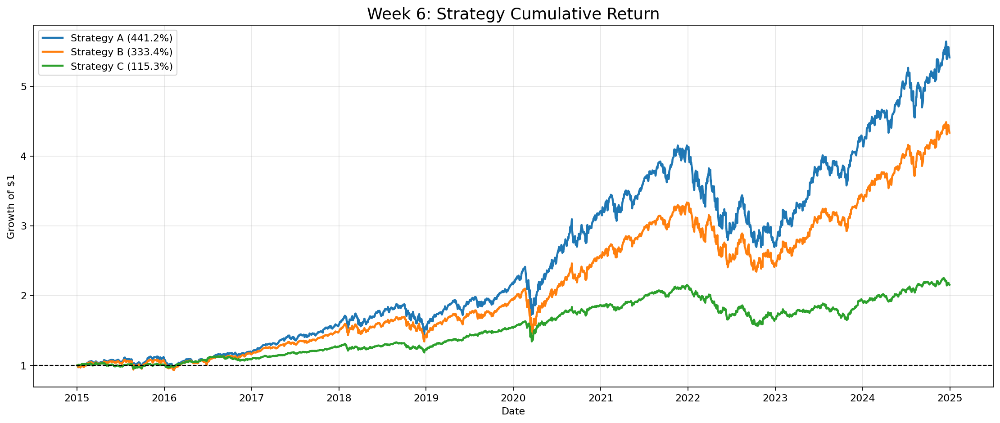
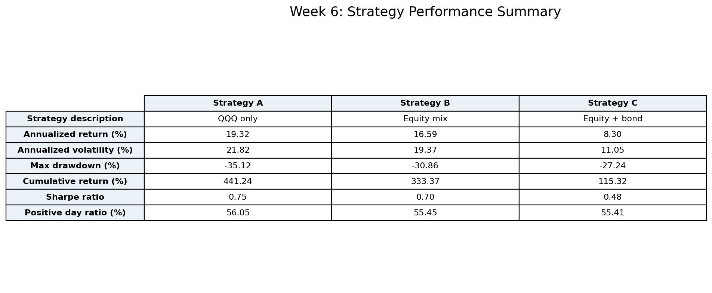
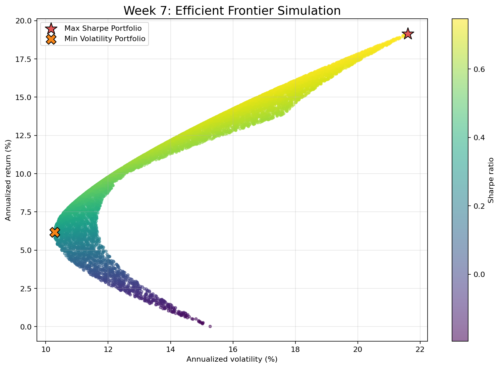
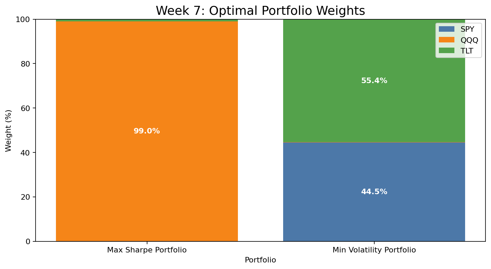
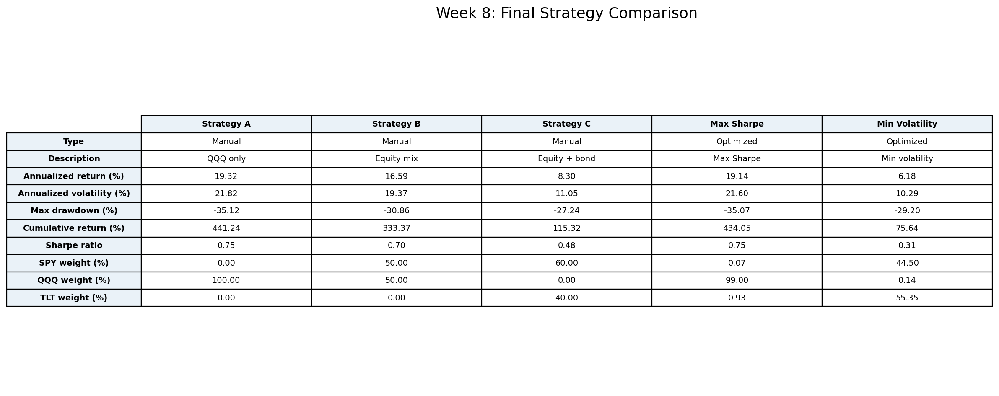
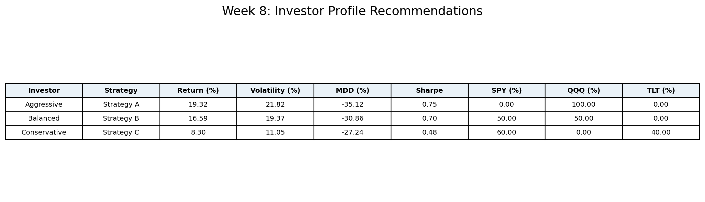

# 리스크 기반 포트폴리오 전략 분석 및 최적화

## 1. 프로젝트 개요

이 프로젝트는 금융 시장 데이터를 이용해 **수익률만이 아니라 리스크까지 고려한 포트폴리오 전략을 설계하고 비교하는 것**을 목표로 진행했다. 분석 대상은 미국 ETF 3개인 `SPY`, `QQQ`, `TLT`이며, 데이터 기간은 `2015-01-02`부터 `2024-12-30`까지다. 단순히 “어떤 자산이 많이 올랐는가”를 보는 데서 끝내지 않고, 변동성, 최대 낙폭, Sharpe Ratio, Efficient Frontier를 함께 계산해 투자 전략의 효율성을 평가했다.

프로젝트의 핵심 질문은 다음 세 가지다.

1. 서로 다른 성격의 자산을 조합하면 리스크는 어떻게 변하는가?
2. 수익률과 리스크를 함께 고려했을 때 가장 효율적인 포트폴리오는 무엇인가?
3. 투자자의 성향에 따라 어떤 전략을 제안할 수 있는가?

최종적으로 수동 전략 3개와 최적화 전략 2개를 비교했고, 공격형·중립형·안정형 투자자별 추천 포트폴리오를 제안했다.

---

## 2. 왜 SPY, QQQ, TLT를 선택했는가

이 프로젝트에서 선택한 세 자산은 엄밀히 말하면 개별 주식이 아니라 ETF다. ETF를 사용한 이유는 개별 기업의 고유 리스크보다 시장·섹터·채권이라는 큰 자산군의 특성을 비교하기에 적합하기 때문이다.

| 자산 | 성격 | 선택 이유 | 리스크 관리 관점의 의미 |
| --- | --- | --- | --- |
| `SPY` | 미국 S&P 500 대표 ETF | 미국 대형주 시장 전체를 대표하는 기준 자산 | 시장 평균에 가까운 성과와 리스크를 제공하는 벤치마크 역할 |
| `QQQ` | 나스닥 100·기술주 중심 ETF | 성장주와 기술주 비중이 높아 장기 수익률이 강한 자산 | 높은 기대수익과 높은 변동성을 동시에 가진 공격형 자산 |
| `TLT` | 미국 장기 국채 ETF | 주식과 성격이 다른 채권 자산을 포함하기 위해 선택 | 주식 리스크를 완화할 수 있는 분산 후보이지만 금리 리스크 존재 |

`SPY`는 미국 주식시장 전체를 대표하는 기준점으로 사용했다. `QQQ`는 기술주 중심의 성장 자산으로, 높은 수익률을 기대할 수 있지만 하락장에서는 손실 폭도 커질 수 있다. `TLT`는 장기 미국 국채 ETF로 주식과 다른 방향으로 움직일 가능성이 있어 포트폴리오 분산 효과를 확인하기 위해 포함했다.

리스크 관리 측면에서 세 자산의 조합은 의미가 있다. `SPY`와 `QQQ`는 모두 주식형 ETF라 장기 성장성은 높지만 주식시장 충격에 동시에 노출된다. 반면 `TLT`는 채권형 ETF라 주식과 다른 리스크 요인을 가진다. 다만 2022년 이후 금리 상승기처럼 채권 가격이 크게 하락하는 환경에서는 `TLT`도 방어 자산으로 완벽하지 않다는 점을 분석을 통해 확인했다.

---

## 3. 데이터와 분석 환경

### 데이터

- 데이터 출처: Yahoo Finance
- 수집 방식: Python `yfinance`
- 저장 파일: `../etf_price.csv`
- 분석 자산: `SPY`, `QQQ`, `TLT`
- 분석 기간: `2015-01-02` ~ `2024-12-30`
- 관측치 수: 2,515개 거래일

### 기술 스택

- Python
- pandas
- numpy
- matplotlib
- seaborn
- yfinance
- Jupyter Notebook

### 주요 산출 코드

| 주차 | 코드 파일 |
| --- | --- |
| 4주차 | `../scripts/week4_return_analysis.py` |
| 5주차 | `../scripts/week5_risk_analysis.py` |
| 6주차 | `../scripts/week6_portfolio_strategy_analysis.py` |
| 7주차 | `../scripts/week7_portfolio_optimization.py` |
| 8주차 | `../scripts/week8_final_strategy_recommendation.py` |

### `Onboarding.ipynb` 실행 흐름 반영

`Onboarding.ipynb`는 프로젝트의 실제 작업 흐름을 기록한 실행 노트북이다. 노트북에서는 먼저 분석 라이브러리를 설치하고, `yfinance`로 `SPY`, `QQQ`, `TLT` 데이터를 내려받은 뒤, Yahoo Finance에서 제공하는 MultiIndex 구조를 확인했다.

```python
import yfinance as yf
import pandas as pd

tickers = ["SPY", "QQQ", "TLT"]

data = yf.download(
    tickers,
    start="2015-01-01",
    end="2024-12-31"
)
```

Yahoo Finance에서 여러 종목을 동시에 다운로드하면 컬럼이 단순한 1차원 구조가 아니라 MultiIndex 구조로 반환된다. 노트북에서는 이 구조를 확인한 뒤, 분석에 필요한 `Close` 가격만 추출했다.

```python
price = data["Close"].copy()
price.to_csv("etf_price.csv")
```

이 전처리는 전체 프로젝트의 기준점이다. 이후 3주차부터 8주차까지의 모든 수익률, 변동성, 포트폴리오 분석은 `etf_price.csv`에 저장된 종가 데이터를 기반으로 수행했다. 노트북에는 최초 가격 추세를 확인하기 위한 기본 가격 차트도 포함되어 있으며, 이후 주차별 분석은 각 스크립트를 `%run`으로 실행하는 방식으로 연결했다.

```python
%run scripts/week4_return_analysis.py
%run scripts/week5_risk_analysis.py
%run scripts/week6_portfolio_strategy_analysis.py
%run scripts/week7_portfolio_optimization.py
%run scripts/week8_final_strategy_recommendation.py
```

따라서 `Onboarding.ipynb`는 단순한 결과 보고서가 아니라, 데이터 수집 → 전처리 → 자산 가격 분석 → 수익률 분석 → 리스크 분석 → 전략 비교 → 최적화 → 최종 제안으로 이어지는 전체 분석 파이프라인을 보여주는 실행 기록이다.

---

## 4. 핵심 금융 개념

### 수익률

일별 수익률은 전일 대비 가격 변화율로 계산했다.

```python
returns = price.pct_change().dropna()
```

누적 수익률은 매일의 수익률을 복리로 누적해 계산했다.

```python
cumulative = (1 + returns).cumprod()
```

이 방식은 “처음 1달러를 투자했을 때 시간이 지나며 얼마가 되는가”를 확인하는 데 적합하다.

### 변동성

변동성은 수익률의 표준편차로 계산했다. 일별 변동성을 연율화하기 위해 연간 거래일 수를 252일로 가정했다.

```python
annualized_volatility = returns.std() * (252 ** 0.5)
```

변동성은 가격이 얼마나 흔들리는지를 보여주는 대표적인 리스크 지표다. 같은 수익률이라도 변동성이 낮으면 더 안정적인 전략으로 평가할 수 있다.

### 최대 낙폭

최대 낙폭은 누적 수익률이 이전 고점 대비 얼마나 크게 하락했는지를 의미한다.

```python
rolling_max = cumulative.cummax()
drawdown = cumulative / rolling_max - 1
mdd = drawdown.min()
```

투자자는 평균 수익률보다 실제 손실 구간을 더 민감하게 체감한다. 따라서 최대 낙폭은 실전 투자 전략을 평가할 때 매우 중요한 지표다.

### Sharpe Ratio

Sharpe Ratio는 위험 대비 초과수익을 측정하는 지표다. 이 프로젝트에서는 무위험 수익률을 연 3%로 가정했다.

```python
sharpe = (annual_return - 0.03) / volatility
```

Sharpe Ratio가 높을수록 같은 리스크를 감수했을 때 더 높은 수익을 얻었다고 해석할 수 있다.

### Efficient Frontier

Efficient Frontier는 여러 포트폴리오 조합 중 동일한 리스크에서 더 높은 수익률을 제공하거나, 동일한 수익률에서 더 낮은 리스크를 제공하는 효율적 조합의 경계를 의미한다. 7주차에서는 Monte Carlo 방식으로 10,000개의 랜덤 비중을 만들고, 각 포트폴리오의 수익률·변동성·Sharpe Ratio를 계산해 효율적 포트폴리오를 찾았다.

---

## 5. 주차별 진행 내용

## 1주차 — 프로젝트 소개 및 금융 기초 개념 학습

1주차에서는 프로젝트의 전체 방향을 설정하고 금융 분석에 필요한 기본 개념을 정리했다. 수익률, 리스크, 변동성, ETF, 포트폴리오의 의미를 학습했다. 단순히 가격이 상승한 자산을 찾는 것이 아니라, 수익률과 리스크를 함께 고려해야 한다는 문제의식을 세웠다. 이 단계에서 프로젝트의 핵심 질문과 KPI를 정의했다.

## 2주차 — 데이터 수집 및 환경 설정

2주차에서는 Python 분석 환경을 구성하고 `yfinance`를 이용해 ETF 데이터를 수집했다. 노트북에서는 `pandas`, `yfinance`, `ipykernel`, `matplotlib`, `seaborn`, `numpy`를 설치한 뒤 분석을 시작했다. 분석 대상은 `SPY`, `QQQ`, `TLT`로 정했고, 2015년부터 2024년까지의 데이터를 가져왔다. Yahoo Finance 데이터는 가격 항목과 티커가 함께 들어 있는 MultiIndex 구조로 반환되기 때문에, 이 구조를 이해한 뒤 `Close` 컬럼만 추출했다. 추출한 종가 데이터는 `etf_price.csv`로 저장했고, 이후 모든 분석은 이 CSV를 기준 데이터로 사용했다.

## 3주차 — 자산 가격 분석

3주차에서는 자산별 가격 흐름을 시각적으로 비교했다. 노트북에서는 먼저 원가격 추세 차트를 그려 `SPY`, `QQQ`, `TLT`의 장기 가격 흐름을 확인했다. 이후 시작 시점을 100으로 맞춘 정규화 가격 차트를 통해 각 ETF의 장기 성장성을 직접 비교했고, 50일·200일 이동평균선을 이용해 단기 추세와 장기 추세를 함께 확인했다. 상관관계 히트맵에서는 `SPY`와 `QQQ`가 강한 양의 상관관계를 보여 두 자산을 함께 보유해도 분산 효과가 제한될 수 있음을 확인했다. 반면 `TLT`는 주식형 ETF와 음의 상관관계를 보여 포트폴리오에 섞으면 리스크 완화 가능성이 있지만, 연도별 수익률 그래프에서는 2022년처럼 주식과 채권이 동시에 하락하는 구간도 존재한다는 점을 확인했다.

노트북의 3주차 분석 항목은 다음 네 가지로 정리된다.

1. 정규화 가격 차트: 시작일 기준 100으로 맞춰 자산 간 성장률 비교
2. 이동평균선: 50일·200일 이동평균으로 추세 확인
3. 상관관계 히트맵: 자산 간 동조화 여부 확인
4. 연도별 연간 수익률: 해마다 각 자산의 성과 비교

## 4주차 — 수익률 분석

4주차에서는 `SPY`, `QQQ`, `TLT`의 일별 수익률과 누적 수익률을 계산했다. 일별 수익률 분포를 시각화해 각 자산의 수익률이 0% 근처에 집중되지만, 주식형 ETF는 더 긴 꼬리를 가진다는 점을 확인했다. 누적 수익률 기준으로 `QQQ`는 `441.24%`, `SPY`는 `240.81%`, `TLT`는 `-11.29%`를 기록했다. 연율화 평균 수익률은 `QQQ`가 `19.32%`, `SPY`가 `13.85%`, `TLT`가 `-0.03%`로 나타났다.

주요 산출물:





## 5주차 — 리스크 분석

5주차에서는 단순 수익률로는 확인하기 어려운 리스크를 수치화했다. 연율화 변동성은 `QQQ`가 `21.82%`, `SPY`가 `17.62%`, `TLT`가 `15.32%`였다. 최대 낙폭은 `QQQ`가 `-35.12%`, `SPY`가 `-33.72%`, `TLT`가 `-48.35%`로 계산됐다. 특히 `TLT`는 채권 ETF임에도 장기 금리 상승기에 큰 손실을 기록했기 때문에, 채권이 항상 안전자산 역할을 하는 것은 아니라는 점을 확인했다.

주요 산출물:


## 6주차 — 포트폴리오 전략 분석

6주차에서는 세 가지 수동 포트폴리오 전략을 설계하고 성과를 비교했다.

| 전략 | 구성 | 목적 |
| --- | --- | --- |
| Strategy A | `QQQ` 100% | 공격적 성장 |
| Strategy B | `SPY` 50% + `QQQ` 50% | 성장성과 분산의 절충 |
| Strategy C | `SPY` 60% + `TLT` 40% | 주식+채권 혼합 방어형 |

성과 비교 결과 Strategy A는 누적 수익률 `441.24%`, Sharpe Ratio `0.75`로 가장 높은 수익을 기록했다. Strategy B는 누적 수익률 `333.37%`, Sharpe Ratio `0.70`으로 수익성과 리스크의 균형이 좋았다. Strategy C는 누적 수익률 `115.32%`, Sharpe Ratio `0.48`로 성과는 낮았지만 변동성과 최대 낙폭을 줄이는 방어적 성격을 보였다.

주요 산출물:





## 7주차 — 포트폴리오 최적화

7주차에서는 `SPY`, `QQQ`, `TLT`의 랜덤 비중 조합 10,000개를 생성해 포트폴리오 최적화를 수행했다. 각 조합에 대해 기대 연율화 수익률, 연율화 변동성, Sharpe Ratio를 계산했다. Max Sharpe Portfolio는 `SPY` `0.07%`, `QQQ` `99.00%`, `TLT` `0.93%`로 거의 `QQQ` 중심이었다. Min Volatility Portfolio는 `SPY` `44.50%`, `QQQ` `0.14%`, `TLT` `55.35%`로 구성되어 변동성을 낮췄지만 누적 수익률은 `75.64%`로 제한적이었다.

이 결과는 최적화 기준이 무엇인지에 따라 전혀 다른 포트폴리오가 선택된다는 점을 보여준다. 위험 대비 수익 효율을 극대화하면 `QQQ` 중심 전략이 선택되지만, 변동성 자체를 최소화하면 `TLT`와 `SPY` 비중이 커진다.

주요 산출물:





## 8주차 — 최종 결과 정리 및 전략 제안

8주차에서는 6주차의 수동 전략 3개와 7주차의 최적화 전략 2개를 통합 비교했다. 최종 비교 대상은 Strategy A, Strategy B, Strategy C, Max Sharpe, Min Volatility이다. 수익률, 변동성, 최대 낙폭, Sharpe Ratio, 자산 비중을 같은 기준으로 정리했다. 최종적으로 투자자 성향에 따라 공격형은 Strategy A, 중립형은 Strategy B, 안정형은 Strategy C를 추천했다.

주요 산출물:





---

## 6. 핵심 분석 결과

## 자산별 성과 요약

| 자산 | 연율화 수익률 | 연율화 변동성 | 최대 낙폭 | 누적 수익률 |
| --- | ---: | ---: | ---: | ---: |
| `QQQ` | `19.32%` | `21.82%` | `-35.12%` | `441.24%` |
| `SPY` | `13.85%` | `17.62%` | `-33.72%` | `240.81%` |
| `TLT` | `-0.03%` | `15.32%` | `-48.35%` | `-11.29%` |

자산 단위에서는 `QQQ`가 가장 높은 수익률을 기록했다. 하지만 변동성도 가장 높아 공격적 자산이라는 특성이 분명했다. `SPY`는 `QQQ`보다 수익률은 낮지만 더 넓은 시장 분산 효과를 제공했다. `TLT`는 채권 ETF로서 분산 후보였지만, 분석 기간에는 금리 상승의 영향을 크게 받아 장기 성과가 부진했다.

## 전략별 성과 요약

| 전략 | 유형 | 연율화 수익률 | 연율화 변동성 | 최대 낙폭 | 누적 수익률 | Sharpe |
| --- | --- | ---: | ---: | ---: | ---: | ---: |
| Strategy A | QQQ 100% | `19.32%` | `21.82%` | `-35.12%` | `441.24%` | `0.75` |
| Strategy B | SPY 50% + QQQ 50% | `16.59%` | `19.37%` | `-30.86%` | `333.37%` | `0.70` |
| Strategy C | SPY 60% + TLT 40% | `8.30%` | `11.05%` | `-27.24%` | `115.32%` | `0.48` |
| Max Sharpe | 최적화 | `19.14%` | `21.60%` | `-35.07%` | `434.05%` | `0.75` |
| Min Volatility | 최적화 | `6.18%` | `10.29%` | `-29.20%` | `75.64%` | `0.31` |

Strategy A와 Max Sharpe는 사실상 `QQQ` 중심 전략으로 거의 같은 성과를 보였다. Strategy B는 `QQQ`의 성장성을 절반 유지하면서 `SPY`를 통해 집중 위험을 낮추는 절충안이다. Strategy C는 변동성을 낮추는 효과가 있었지만, `TLT`의 부진 때문에 수익률은 제한적이었다. Min Volatility는 변동성은 가장 낮았지만, 수익률과 Sharpe Ratio가 낮아 최종 추천 전략으로는 적합성이 떨어졌다.

---

## 7. 리스크 관리 관점에서의 의의

이 프로젝트의 핵심은 수익률이 높은 자산을 찾는 것이 아니라, **수익률을 얻기 위해 어느 정도의 위험을 감수했는지**를 확인하는 데 있다.

첫째, `QQQ`는 장기 성과가 가장 좋았지만 변동성과 낙폭도 컸다. 이는 높은 수익률이 공짜로 얻어진 것이 아니라, 큰 손실 구간을 견딘 결과라는 의미다. 공격형 투자자는 이런 변동성을 감수할 수 있지만, 안정형 투자자에게는 부담이 클 수 있다.

둘째, `SPY`는 시장 전체에 분산되어 있어 `QQQ`보다 안정적이다. Strategy B에서 `SPY`와 `QQQ`를 50:50으로 섞었을 때 누적 수익률은 낮아졌지만 최대 낙폭도 완화됐다. 이는 포트폴리오 구성에서 특정 성장 자산에 집중하는 것보다 시장 대표 자산을 함께 보유하는 것이 리스크 관리에 유리할 수 있음을 보여준다.

셋째, `TLT`는 전통적으로 주식 리스크를 완화하는 채권 자산으로 기대되지만, 분석 기간에는 금리 상승의 영향을 크게 받았다. 특히 2022년 이후 장기 국채 가격이 하락하면서 `TLT`도 큰 낙폭을 기록했다. 따라서 채권 편입은 유효한 분산 방법이지만, 금리 리스크를 반드시 함께 고려해야 한다.

넷째, Sharpe Ratio와 Efficient Frontier는 단순 성과 비교보다 더 정교한 판단을 가능하게 했다. 같은 수익률이라도 변동성이 낮으면 더 효율적인 전략일 수 있고, 같은 변동성이라도 수익률이 높으면 더 좋은 포트폴리오로 볼 수 있다. 이 프로젝트에서는 Max Sharpe가 `QQQ` 중심으로 도출됐지만, 이는 특정 기간의 과거 데이터에 기반한 결과이므로 미래에도 그대로 반복된다고 가정해서는 안 된다.

---

## 8. 최종 투자자 성향별 추천

| 투자자 성향 | 추천 전략 | 추천 비중 | 추천 이유 |
| --- | --- | --- | --- |
| 공격형 | Strategy A | `QQQ` 100% | 가장 높은 누적 수익률과 높은 Sharpe Ratio를 기록했지만 큰 낙폭을 감수해야 함 |
| 중립형 | Strategy B | `SPY` 50% + `QQQ` 50% | 성장성과 리스크 관리의 균형이 가장 현실적임 |
| 안정형 | Strategy C | `SPY` 60% + `TLT` 40% | 수익률은 낮지만 변동성과 낙폭을 줄이는 방어형 전략 |

최종 추천에서 가장 중요한 판단은 투자자의 위험 감내도다. 높은 수익을 목표로 하고 큰 하락을 견딜 수 있다면 Strategy A가 적합하다. 수익성과 안정성의 균형을 원한다면 Strategy B가 가장 현실적인 선택이다. 자산 가격의 흔들림을 줄이는 것이 우선이라면 Strategy C가 적합하지만, 채권 ETF도 금리 리스크를 가진다는 점을 이해해야 한다.

---

## 9. 프로젝트 KPI 달성 여부

| KPI | 달성 여부 | 근거 |
| --- | --- | --- |
| 최소 3개 이상 자산 분석 | 달성 | `SPY`, `QQQ`, `TLT` 분석 |
| 금융 데이터 전처리 및 수익률 계산 | 달성 | `etf_price.csv`, 일별·누적 수익률 계산 |
| 변동성 계산 | 달성 | 일별 변동성, 연율화 변동성, 롤링 변동성 계산 |
| 최대 낙폭 계산 | 달성 | 자산별·전략별 MDD 계산 |
| Sharpe Ratio 계산 | 달성 | 전략별·최적화 포트폴리오별 Sharpe 계산 |
| 최소 3개 전략 설계 | 달성 | Strategy A, B, C 설계 |
| 데이터 시각화 5개 이상 | 달성 | 주차별 결과 이미지 다수 생성 |
| 최종 전략 제안 | 달성 | 투자자 성향별 추천 전략 제시 |

---

## 10. 한계와 개선 방향

이 프로젝트는 과거 데이터를 기반으로 한 분석이므로 미래 수익률을 보장하지 않는다. 특히 2015~2024년은 미국 기술주가 강한 성과를 보인 기간이므로 `QQQ` 중심 전략이 유리하게 나왔다. 다른 기간을 선택하면 Max Sharpe 포트폴리오의 구성은 달라질 수 있다.

또한 거래 비용, 세금, ETF 운용보수, 리밸런싱 비용은 반영하지 않았다. 실제 투자에서는 매매 빈도와 리밸런싱 방식에 따라 성과가 달라질 수 있다. 특히 고정 비중 포트폴리오는 주기적으로 리밸런싱해야 하므로, 리밸런싱 주기를 월간·분기·연간으로 나누어 추가 분석할 수 있다.

추가 개선 방향은 다음과 같다.

- 무위험 수익률을 고정 3%가 아니라 기간별 미국 국채 금리로 대체
- 월간 또는 분기별 리밸런싱 시뮬레이션 추가
- 거래 비용과 세금 반영
- 2008 금융위기, 2020 코로나19, 2022 금리 상승기 등 구간별 스트레스 테스트
- `GLD`, `VNQ`, `BND`, `IWM` 등 다른 자산군 ETF 추가
- VaR, CVaR, Sortino Ratio 같은 추가 리스크 지표 도입
- 훈련 기간과 검증 기간을 나누어 과최적화 여부 점검

---

## 11. 최종 결론

이 프로젝트의 결론은 명확하다. 수익률만 보면 `QQQ` 중심 전략이 가장 우수했지만, 리스크까지 고려하면 투자자 성향에 따라 다른 선택이 필요하다. `SPY`는 시장 대표 자산으로 안정적인 기준점 역할을 했고, `QQQ`는 높은 성장성과 높은 변동성을 동시에 보여줬다. `TLT`는 분산 후보였지만 금리 상승기에는 큰 손실을 낼 수 있어 채권도 별도의 리스크 관리가 필요하다는 점을 확인했다.

최종적으로 공격형 투자자에게는 `QQQ` 중심 전략, 중립형 투자자에게는 `SPY`와 `QQQ`를 결합한 전략, 안정형 투자자에게는 `SPY`와 `TLT`를 결합한 전략을 제안한다. 포트폴리오 설계에서 중요한 것은 하나의 절대적 정답을 찾는 것이 아니라, 수익률·변동성·최대 낙폭·Sharpe Ratio를 함께 보고 자신의 위험 감내도에 맞는 전략을 선택하는 것이다.
