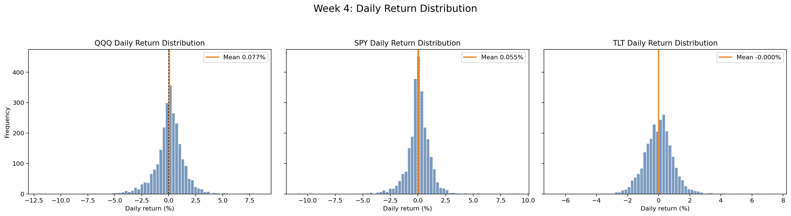
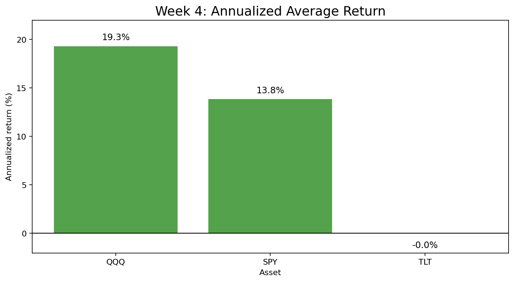

# Week 4 — 수익률 분석

## 주요 결과물 이미지

## 수익률 요약표

| Metric | QQQ | SPY | TLT |
| --- | --- | --- | --- |
| Daily mean (%) | 0.08 | 0.05 | 0.00 |
| Annualized return (%) | 19.32 | 13.85 | -0.03 |
| Daily volatility (%) | 1.37 | 1.11 | 0.96 |
| Positive day ratio (%) | 56.05 | 54.61 | 51.27 |
| Cumulative return (%) | 441.24 | 240.81 | -11.29 |
| Best daily return (%) | 8.47 | 9.06 | 7.52 |
| Worst daily return (%) | -11.98 | -10.94 | -6.67 |

## 분석 내용

이번 4주차 분석은 2015-01-02부터 2024-12-30까지의 QQQ, SPY, TLT 종가를 기준으로 일별 수익률과 누적 수익률을 계산했다. 일별 수익률은 전일 대비 가격 변화율로 정의했고, 연율화 수익률은 일평균 수익률에 연간 거래일 수 252일을 곱해 산출했다. 이 방식은 자산별 성과를 같은 시간 단위로 비교하기 위한 기준이며, 위험 조정 성과는 이후 주차의 변동성·MDD·Sharpe Ratio 분석에서 별도로 판단한다.

수익률 분포를 보면 세 ETF 모두 대부분의 일별 수익률이 0% 근처에 몰려 있지만, QQQ와 SPY는 좌우 꼬리가 더 길게 나타난다. QQQ의 일평균 수익률은 0.08%로 가장 높고, SPY는 0.05%로 그 뒤를 따른다. TLT는 일평균 수익률이 0.00%로 거의 0에 가까워, 분석 기간 전체에서 채권 ETF가 주식 ETF 대비 뚜렷한 성장 동력을 제공하지 못했다.

누적 수익률 기준으로는 QQQ가 441.24%로 가장 강한 성과를 보였고, SPY는 240.81%를 기록했다. 같은 기간 TLT의 누적 수익률은 -11.29%로 음수였기 때문에, 2015년 초에 1달러를 투자했다면 2024년 말 기준 원금보다 낮은 수준으로 끝난다. 특히 2022년 이후 금리 상승 구간에서 TLT가 약세를 보이면서 주식 ETF와의 성과 격차가 크게 확대된 것으로 해석된다.

연율화 평균 수익률도 같은 결론을 뒷받침한다. QQQ는 19.32%로 가장 높고, SPY는 13.85%를 기록했다. TLT는 -0.03%로 사실상 수익 기여가 없었다. 다만 QQQ는 일별 변동성도 1.37%로 가장 높으므로, 단순 수익률만으로 최적 자산이라고 결론내리기는 어렵다. 5주차에서는 변동성, 최대 낙폭, 롤링 변동성을 계산해 이번 수익률 결과가 감수한 위험 대비 적절했는지 검증해야 한다.
