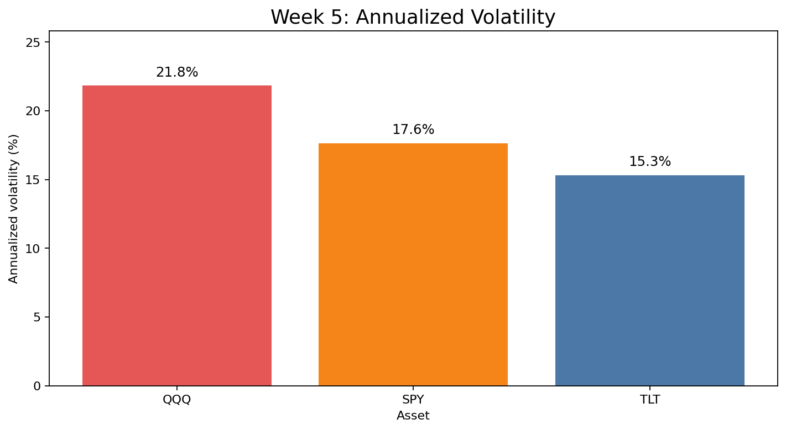
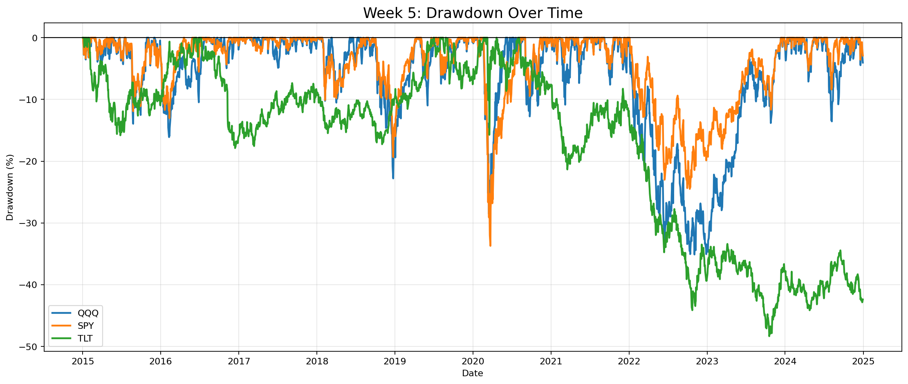
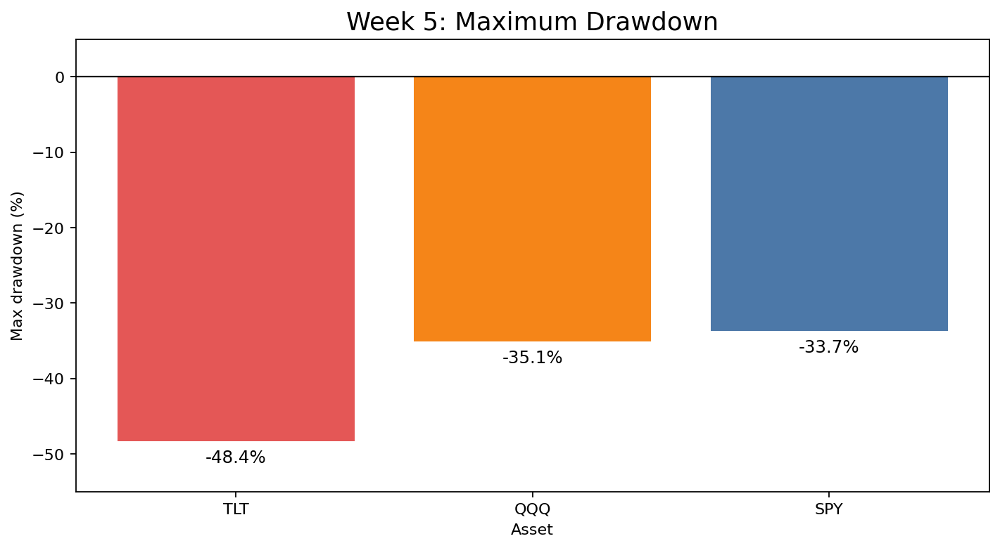
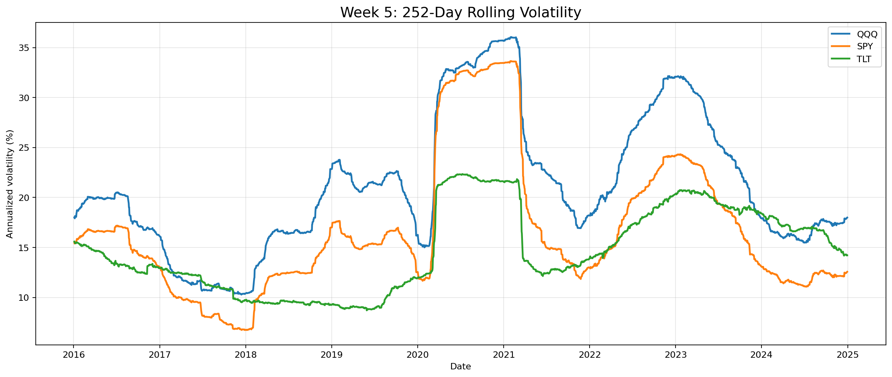
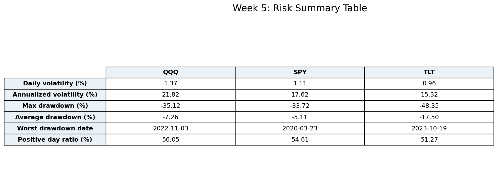

# Week 5 — 리스크 분석

## 주요 결과물 이미지

## 리스크 요약표

| Metric | QQQ | SPY | TLT |
| --- | --- | --- | --- |
| Daily volatility (%) | 1.37 | 1.11 | 0.96 |
| Annualized volatility (%) | 21.82 | 17.62 | 15.32 |
| Max drawdown (%) | -35.12 | -33.72 | -48.35 |
| Average drawdown (%) | -7.26 | -5.11 | -17.50 |
| Worst drawdown date | 2022-11-03 | 2020-03-23 | 2023-10-19 |
| Positive day ratio (%) | 56.05 | 54.61 | 51.27 |

## 분석 내용

이번 5주차 분석은 2015-01-02부터 2024-12-30까지의 QQQ, SPY, TLT 일별 수익률을 이용해 변동성, 최대 낙폭, 롤링 변동성을 계산했다. 변동성은 일별 수익률의 표준편차를 연율화해 비교했고, 최대 낙폭은 누적 수익률이 직전 고점 대비 얼마나 크게 하락했는지를 측정했다. 따라서 이번 분석은 4주차의 단순 수익률 순위가 실제로 얼마나 큰 위험을 동반했는지 확인하는 단계다.

연율화 변동성은 QQQ가 21.82%로 가장 높고, SPY는 17.62%, TLT는 15.32%를 기록했다. 4주차에서 QQQ가 가장 높은 누적 수익률을 보였지만, 동시에 가격 흔들림도 가장 컸다. 이는 성장형 기술주 중심 ETF의 고수익이 높은 변동성을 감수한 결과라는 점을 보여준다. SPY는 QQQ보다 낮은 수익률을 냈지만 변동성도 낮아, 시장 전체에 분산된 자산의 안정성이 일부 확인된다.

최대 낙폭 기준으로는 TLT의 손실 구간이 가장 깊었다. QQQ의 최대 낙폭은 -35.12%, SPY는 -33.72%, TLT는 -48.35%다. 특히 TLT는 주식 ETF보다 장기 수익률이 낮았음에도 최대 낙폭이 작지 않았기 때문에, 채권 ETF가 모든 기간에서 자동으로 안전자산 역할을 한다고 보기는 어렵다. 2022년 금리 상승 국면처럼 채권 가격에 불리한 환경에서는 TLT도 의미 있는 손실을 기록할 수 있다.

롤링 변동성 차트에서는 시장 충격 시기에 세 자산의 위험이 동시에 상승하는 모습을 확인할 수 있다. 특히 2020년 코로나19 충격과 2022년 금리 상승 구간에서 변동성이 커졌고, 이 시기에는 단순히 자산을 나누어 보유하는 것만으로 리스크가 완전히 사라지지 않는다. 5주차 결론은 QQQ가 가장 높은 수익률과 가장 높은 위험을 동시에 가진 자산이며, SPY는 상대적으로 중간 수준의 위험·수익 특성을 보이고, TLT는 분산 효과 후보이지만 금리 환경에 따라 별도 리스크를 가진다는 것이다. 6주차에서는 이 특성을 바탕으로 QQQ 단일, 주식 혼합, 주식+채권 전략을 구성해 포트폴리오 단위의 성과를 비교한다.
