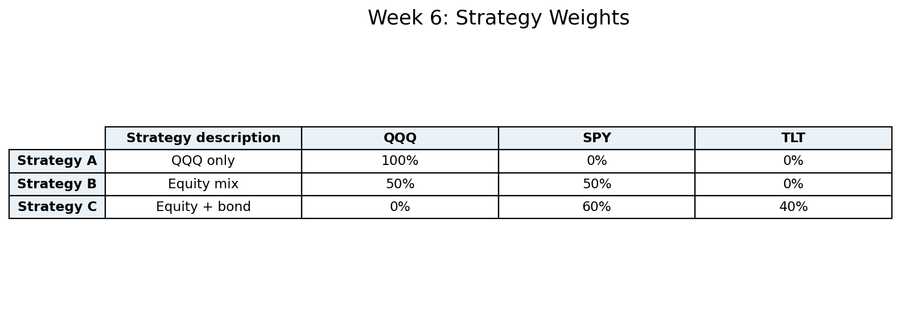
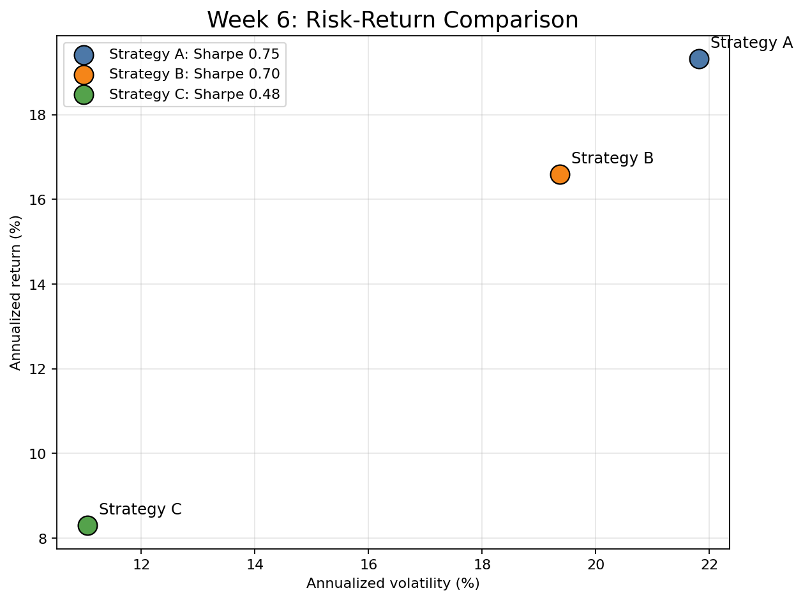
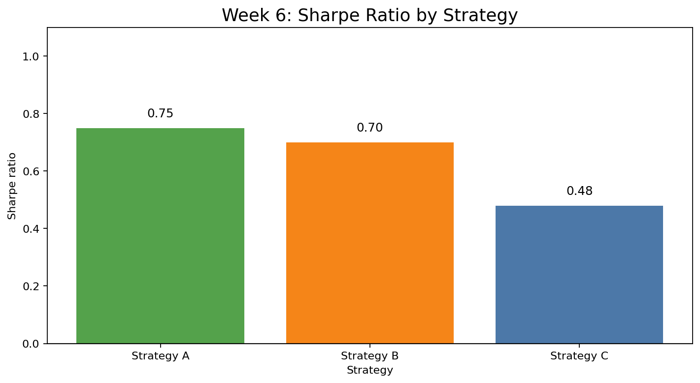
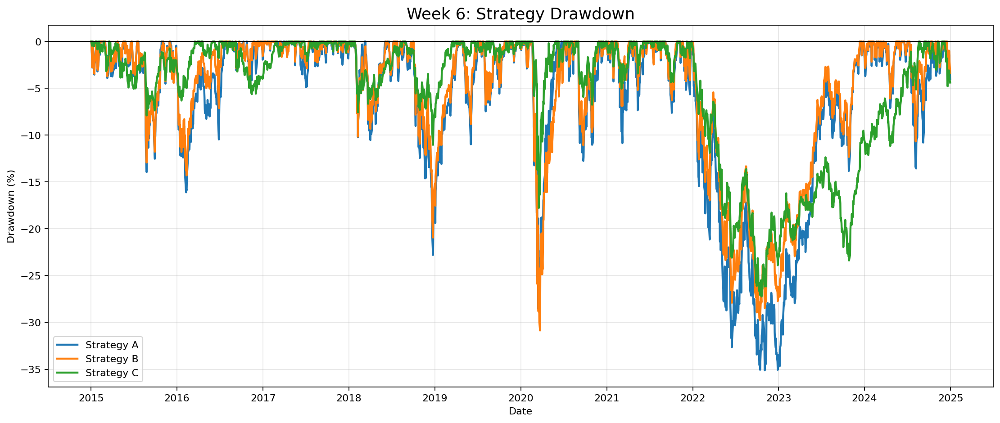

# Week 6 — 포트폴리오 전략 분석

## 주요 결과물 이미지

## 전략 성과 요약표

| Metric | Strategy A | Strategy B | Strategy C |
| --- | --- | --- | --- |
| Strategy description | QQQ 단일 | 주식 혼합 | 주식+채권 |
| Annualized return (%) | 19.32 | 16.59 | 8.30 |
| Annualized volatility (%) | 21.82 | 19.37 | 11.05 |
| Max drawdown (%) | -35.12 | -30.86 | -27.24 |
| Cumulative return (%) | 441.24 | 333.37 | 115.32 |
| Sharpe ratio | 0.75 | 0.70 | 0.48 |
| Positive day ratio (%) | 56.05 | 55.45 | 55.41 |

## 분석 내용

이번 6주차 분석은 2015-01-02부터 2024-12-30까지의 ETF 일별 수익률을 이용해 세 가지 포트폴리오 전략을 비교했다. 전략 A는 QQQ 100%의 공격적 성장 전략이고, 전략 B는 SPY 50%와 QQQ 50%를 결합한 주식 혼합 전략이며, 전략 C는 SPY 60%와 TLT 40%를 결합한 주식+채권 전략이다. 모든 전략은 매일 고정 비중으로 수익률을 합산하는 방식으로 계산했으며, 무위험 수익률은 연 3%로 두고 Sharpe Ratio를 산출했다.

누적 수익률은 전략 A가 441.24%로 가장 높았고, 전략 B는 333.37%, 전략 C는 115.32%를 기록했다. 이는 4주차에서 확인한 QQQ의 강한 장기 성과가 포트폴리오 전략에서도 그대로 반영된 결과다. 다만 전략 A의 연율화 변동성은 21.82%로 가장 높아, 높은 수익률이 가장 큰 가격 변동을 동반했다는 점도 함께 확인된다.

전략 B는 연율화 수익률 16.59%, 변동성 19.37%, Sharpe Ratio 0.70를 기록했다. QQQ 단일 전략보다 수익률은 낮지만 변동성과 최대 낙폭도 낮아진다. 즉 SPY를 섞는 방식은 성장성을 일부 유지하면서 QQQ 집중 위험을 줄이는 절충안으로 해석할 수 있다.

전략 C는 TLT를 40% 편입했기 때문에 변동성은 11.05%로 낮아졌지만, 누적 수익률과 Sharpe Ratio가 크게 개선되지는 않았다. 특히 분석 기간에 TLT가 장기적으로 부진했고 2022년 이후 큰 낙폭을 겪었기 때문에, 채권 편입이 항상 성과 개선으로 이어지지는 않았다. 이 기간 기준으로 Sharpe Ratio가 가장 높은 전략은 Strategy A이고, 최대 낙폭이 가장 작았던 전략은 Strategy C다.

6주차 결론은 단순 수익률 우선이면 전략 A가 가장 강하지만, 위험을 함께 고려하면 전략 B가 더 균형적인 선택이라는 것이다. 전략 C는 방어적 목적의 후보지만, 금리 상승 환경에서 채권 ETF가 포트폴리오 방어 역할을 충분히 하지 못할 수 있다는 한계가 드러났다. 7주차에서는 고정 전략 3개를 넘어서 임의 비중 조합을 대량으로 생성하고, Sharpe Ratio와 변동성 기준의 최적 포트폴리오를 찾는다.
