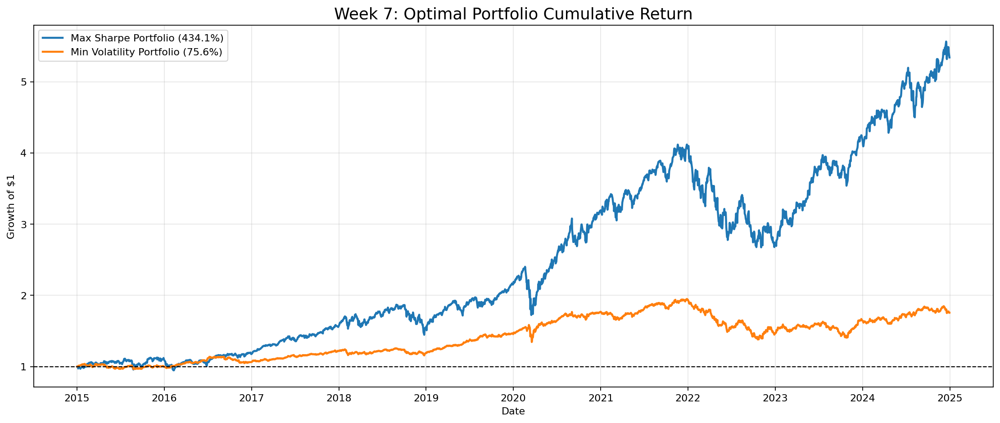
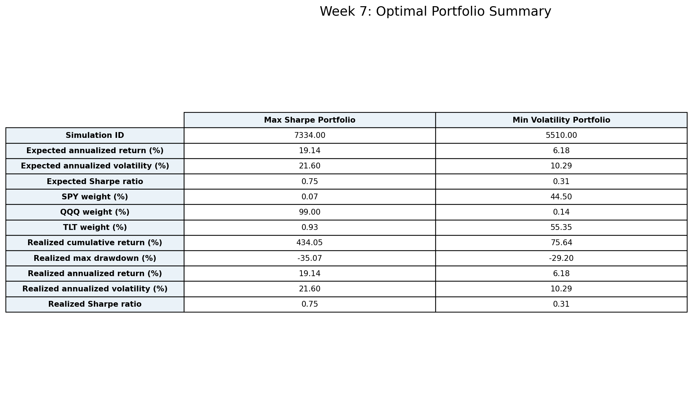

# Week 7 — 포트폴리오 최적화

## 주요 결과물 이미지

## 최적 포트폴리오 요약표

| Metric | Max Sharpe Portfolio | Min Volatility Portfolio |
| --- | --- | --- |
| Simulation ID | 7334.00 | 5510.00 |
| Expected annualized return (%) | 19.14 | 6.18 |
| Expected annualized volatility (%) | 21.60 | 10.29 |
| Expected Sharpe ratio | 0.75 | 0.31 |
| SPY weight (%) | 0.07 | 44.50 |
| QQQ weight (%) | 99.00 | 0.14 |
| TLT weight (%) | 0.93 | 55.35 |
| Realized cumulative return (%) | 434.05 | 75.64 |
| Realized max drawdown (%) | -35.07 | -29.20 |
| Realized annualized return (%) | 19.14 | 6.18 |
| Realized annualized volatility (%) | 21.60 | 10.29 |
| Realized Sharpe ratio | 0.75 | 0.31 |

## 분석 내용

이번 7주차 분석은 2015-01-02부터 2024-12-30까지의 SPY, QQQ, TLT 일별 수익률을 기반으로 10,000개의 랜덤 비중 조합을 생성하고, 각 조합의 기대 연율화 수익률, 연율화 변동성, Sharpe Ratio를 계산했다. 비중은 세 자산 합계가 100%가 되도록 Dirichlet 분포로 생성했으며, 무위험 수익률은 6주차와 동일하게 연 3%로 가정했다.

Efficient Frontier 산점도는 변동성이 커질수록 기대 수익률도 높아지는 전형적인 위험·수익 관계를 보여준다. 다만 같은 변동성 수준에서도 Sharpe Ratio가 다른 포트폴리오가 존재하므로, 단순히 수익률이 높은 조합을 선택하는 것보다 동일 위험에서 더 높은 보상을 주는 조합을 찾는 것이 중요하다. 색상이 밝게 나타나는 구간은 위험 대비 수익 효율이 높은 조합이며, 이 구간에서 Max Sharpe Portfolio가 선택된다.

Max Sharpe Portfolio는 SPY 0.07%, QQQ 99.00%, TLT 0.93%로 구성된다. 기대 연율화 수익률은 19.14%, 기대 변동성은 21.60%, Sharpe Ratio는 0.75다. 이 결과는 분석 기간에서 QQQ의 성장성과 위험 대비 성과가 워낙 강했기 때문에, Sharpe Ratio 최적화가 사실상 QQQ 중심 포트폴리오로 수렴했음을 의미한다. 즉 이 기간에는 분산 자체보다 QQQ 노출 여부가 수익 효율을 크게 좌우했다.

Min Volatility Portfolio는 SPY 44.50%, QQQ 0.14%, TLT 55.35%로 구성된다. 기대 연율화 수익률은 6.18%, 기대 변동성은 10.29%, Sharpe Ratio는 0.31다. 변동성 최소화 목적에서는 TLT 비중이 크게 올라가지만, 2015~2024년 기간에는 TLT의 장기 성과가 약했기 때문에 누적 성과는 Max Sharpe 포트폴리오보다 낮아진다.

7주차 결론은 최적화 기준에 따라 전혀 다른 포트폴리오가 선택된다는 것이다. 수익 효율을 중시하면 Max Sharpe Portfolio가 적합하고, 가격 흔들림 자체를 최소화하려면 Min Volatility Portfolio가 적합하다. 그러나 Min Volatility는 수익 기회도 크게 줄일 수 있으므로, 최종 전략 제안에서는 6주차의 고정 전략과 7주차의 최적화 전략을 함께 비교해 투자자 성향별 추천안을 분리하는 것이 타당하다.
