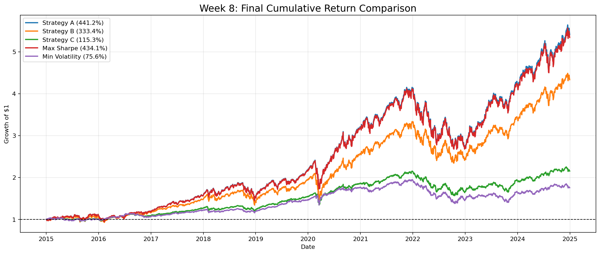
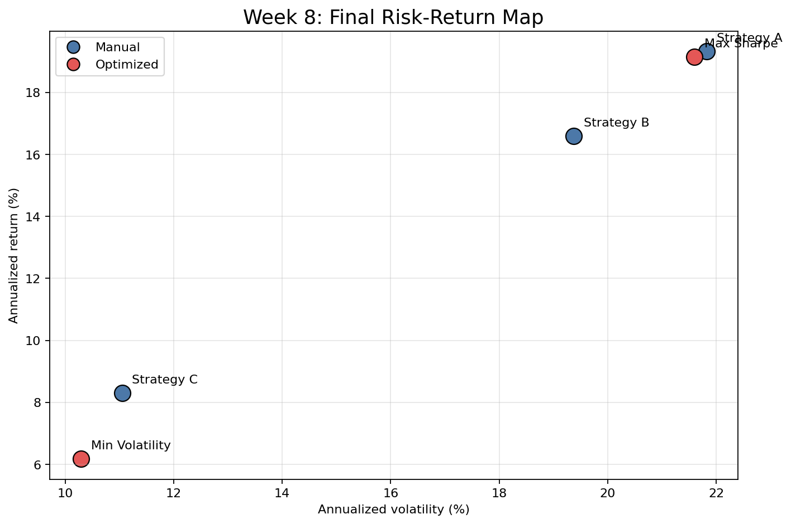
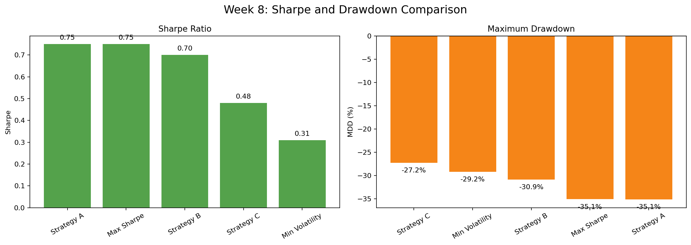

# Week 8 — 최종 결과 정리 및 전략 제안

## 주요 결과물 이미지

## 최종 전략 비교표

| Metric | Strategy A | Strategy B | Strategy C | Max Sharpe | Min Volatility |
| --- | --- | --- | --- | --- | --- |
| Type | Manual | Manual | Manual | Optimized | Optimized |
| Description | QQQ only | Equity mix | Equity + bond | Max Sharpe | Min volatility |
| Annualized return (%) | 19.32 | 16.59 | 8.30 | 19.14 | 6.18 |
| Annualized volatility (%) | 21.82 | 19.37 | 11.05 | 21.60 | 10.29 |
| Max drawdown (%) | -35.12 | -30.86 | -27.24 | -35.07 | -29.20 |
| Cumulative return (%) | 441.24 | 333.37 | 115.32 | 434.05 | 75.64 |
| Sharpe ratio | 0.75 | 0.70 | 0.48 | 0.75 | 0.31 |
| SPY weight (%) | 0.00 | 50.00 | 60.00 | 0.07 | 44.50 |
| QQQ weight (%) | 100.00 | 50.00 | 0.00 | 99.00 | 0.14 |
| TLT weight (%) | 0.00 | 0.00 | 40.00 | 0.93 | 55.35 |

## 투자자 성향별 추천

| Investor | Recommended strategy | Reason |
| --- | --- | --- |
| Aggressive | Strategy A | Highest cumulative return and near-identical result to Max Sharpe |
| Balanced | Strategy B | Strong return with lower concentration risk than QQQ-only |
| Conservative | Strategy C | Lower drawdown than equity-only strategies with better return than Min Volatility |

## 분석 내용

이번 최종 정리는 2015-01-02부터 2024-12-30까지의 ETF 데이터를 기반으로 6주차 수동 전략 3개와 7주차 최적화 전략 2개를 같은 기준에서 비교했다. 비교 지표는 누적 수익률, 연율화 수익률, 연율화 변동성, 최대 낙폭, Sharpe Ratio이며, 무위험 수익률은 앞선 분석과 동일하게 연 3%로 가정했다.

수익률 관점에서는 Strategy A가 누적 수익률 441.24%로 가장 높다. Max Sharpe 전략도 누적 수익률 434.05%로 Strategy A와 거의 유사한데, 이는 7주차 최적화 결과가 QQQ 비중 99.00%의 QQQ 중심 구조로 수렴했기 때문이다. 즉 2015~2024년 구간에서는 QQQ 노출이 장기 성과를 좌우한 핵심 요인이었다.

위험 대비 성과 관점에서는 Strategy A의 Sharpe Ratio가 0.75로 가장 높다. 다만 Strategy A와 Max Sharpe는 모두 QQQ 집중도가 높아 최대 낙폭이 약 -35% 수준이다. 성장성이 강한 대신 큰 손실 구간을 견뎌야 한다는 의미다. 반대로 Strategy B는 누적 수익률 333.37%, Sharpe Ratio 0.70, 최대 낙폭 -30.86%로 수익성과 리스크의 균형이 가장 현실적인 절충안에 가깝다.

방어적 전략에서는 Strategy C와 Min Volatility를 구분해서 해석해야 한다. Min Volatility는 연율화 변동성 10.29%로 가장 낮지만 누적 수익률은 75.64%에 그친다. Strategy C는 변동성이 11.05%로 조금 높지만 누적 수익률 115.32%와 최대 낙폭 -27.24%가 더 나은 편이다. 따라서 단순히 변동성을 최소화하는 것보다 실제 성과와 낙폭을 함께 보는 것이 더 타당하다.

최종 제안은 투자자 성향별로 나누는 것이 합리적이다. 공격형 투자자는 큰 낙폭을 감수할 수 있다면 Strategy A 또는 Max Sharpe를 선택할 수 있다. 중립형 투자자에게는 Strategy B가 가장 적합하다. QQQ의 성장성을 유지하면서 SPY를 통해 집중 위험을 낮추기 때문이다. 안정형 투자자에게는 Strategy C가 더 현실적이다. Min Volatility보다 변동성은 약간 높지만, 성과와 낙폭 지표를 함께 보면 더 균형적인 방어형 전략이다.

전체 프로젝트의 핵심 결론은 수익률만으로는 전략을 결정할 수 없다는 것이다. QQQ 중심 전략은 높은 성과를 냈지만 큰 낙폭을 동반했고, TLT 편입 전략은 변동성 완화 가능성이 있지만 금리 상승기에는 방어력이 제한되었다. 따라서 포트폴리오 설계에서는 수익률, 변동성, 최대 낙폭, Sharpe Ratio를 함께 보고 투자자 성향에 맞게 전략을 선택해야 한다.
